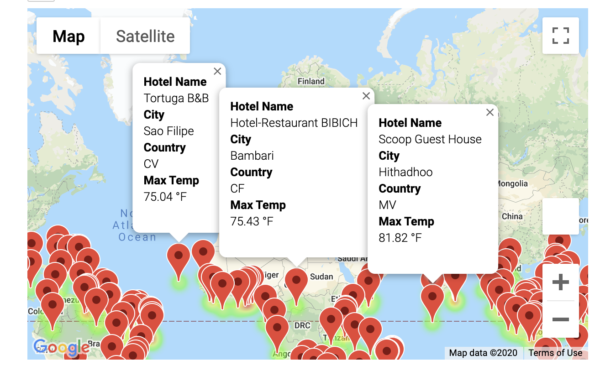

# World_Weather_Analysis

## Summary 

The purpose of this challenge was to create code that would 1) generate a random set of 1500 latitutdes and longitudes, 2) Use citipy to find the closet towns and cities to those latitudes and longitudes, 3) use APIs to pull weather data for those locations, 4) use user input and 4) use Google Maps API to pull hotel infromation as well as directions to those hotels. This was done to help a travel app and their customers. 

Below are some screenshots of heat layer maps that were created as well as hotel information and directions.

Example of a heat map 
 

Map with hotel info and markers 
 

Directions for hotels for selected cities. 

